# trip_Spring_Gwangju_04_JaeHyung_KyuHyeon

# Trip Swagger  
## REST API
### 1.User 회원

- userId로 email과 비밀번호 반환받아 이메일 전송 
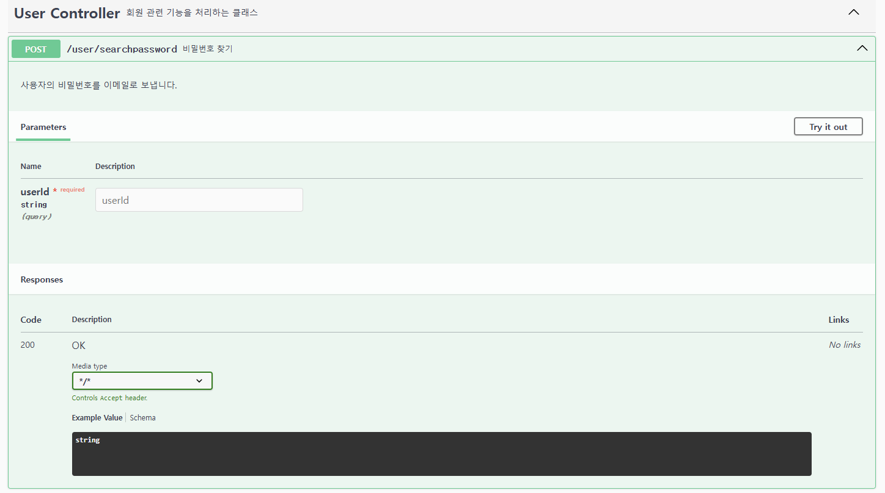

- userId,password로 로그인

- 회원가입을 위한 화면 전환 
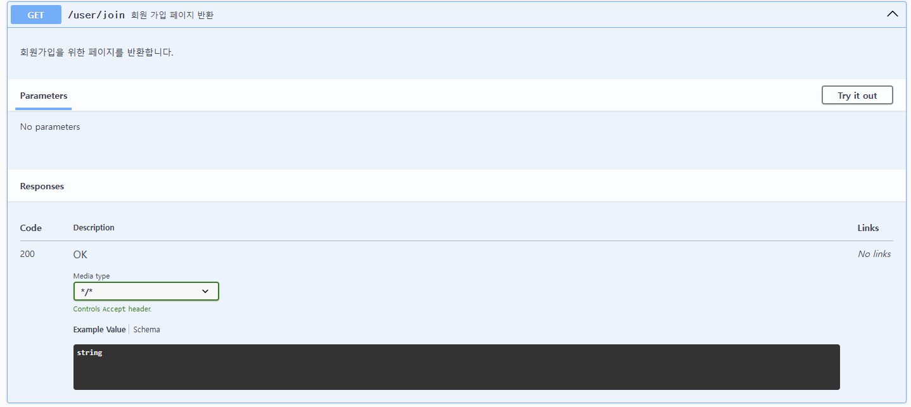

- 중복 Id 체크 
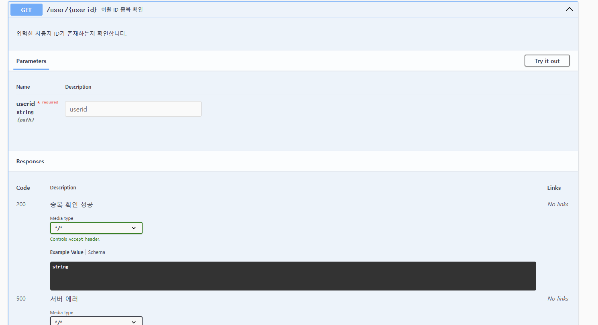

- 로그아웃 
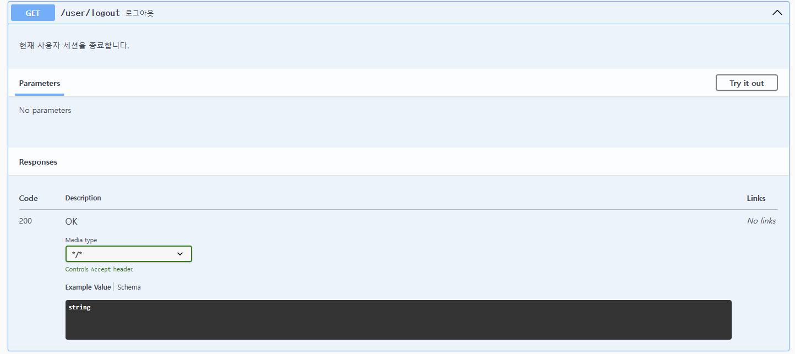

- 회원목록 화면 전환
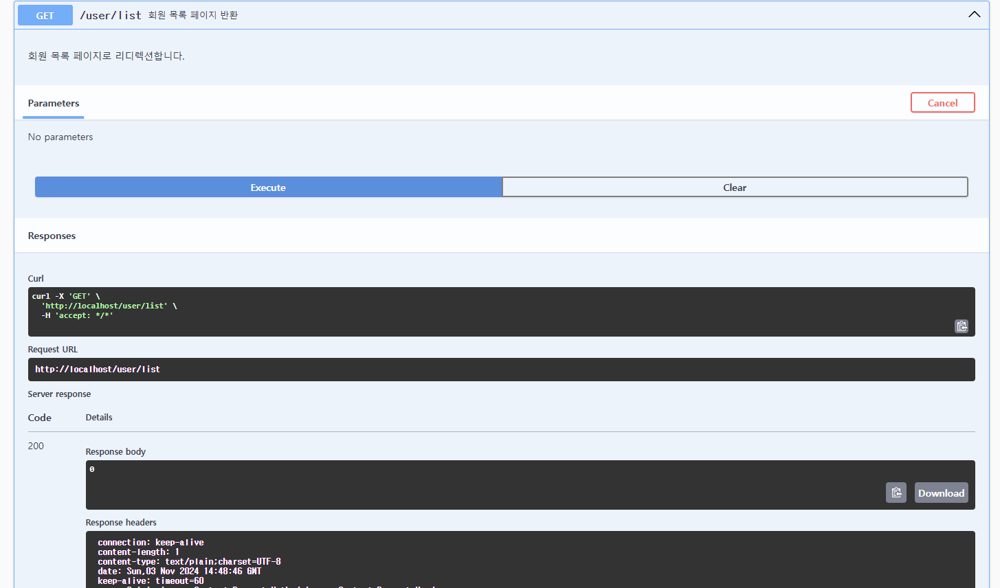

### 2. Admin 관리자

- 회원 전체 목록 반환 
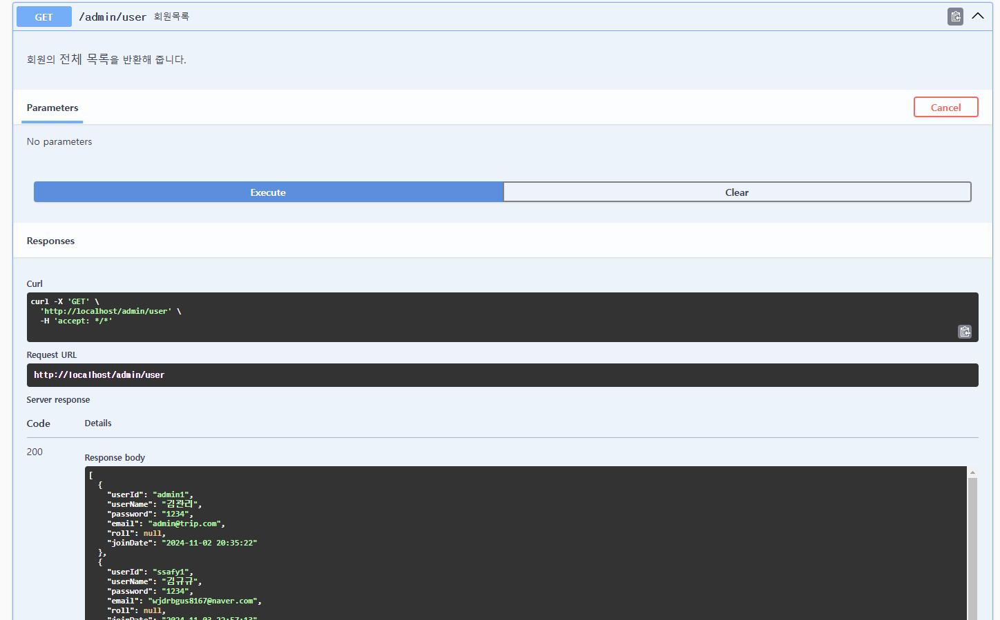

- MemberDto로 회원정보 수정 
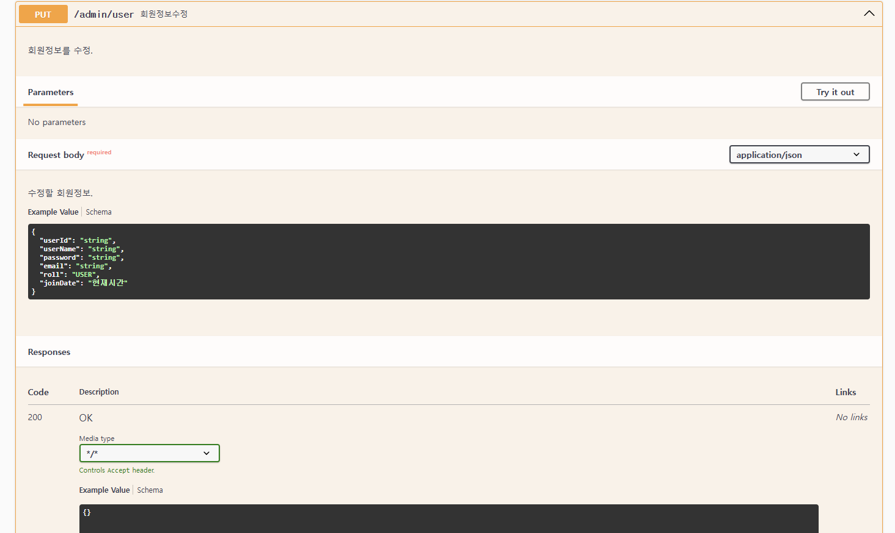

- MemberDto로 회원 등록
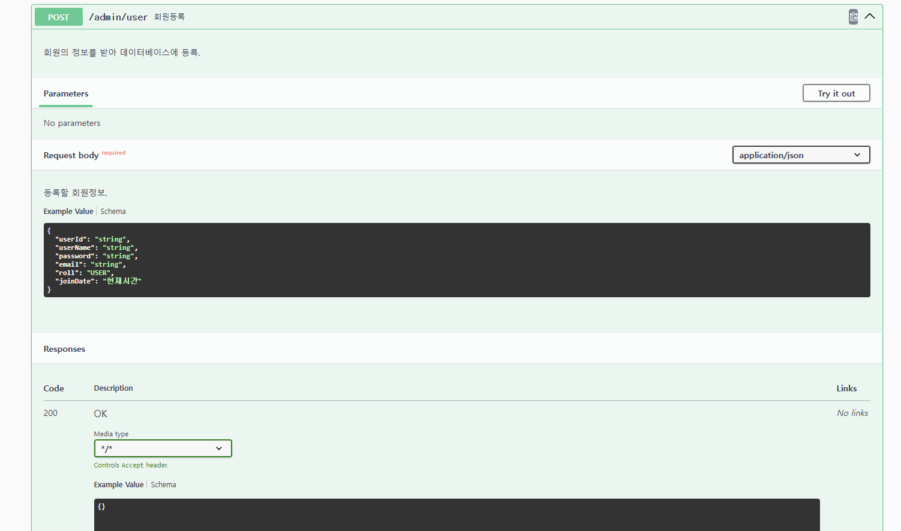

- 사용자 id로 회원정보 조회 
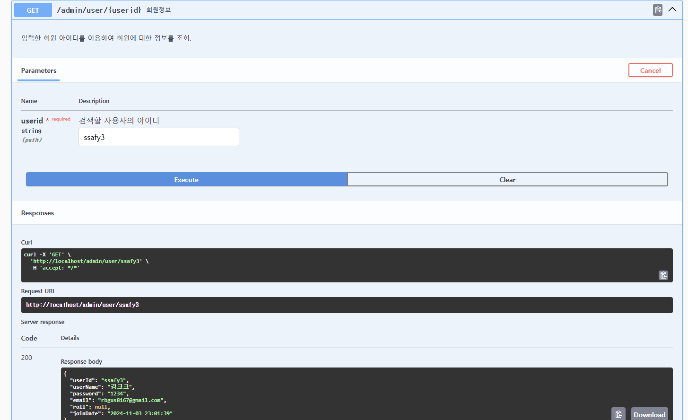

- 사용자 id로 회원정보 삭제 
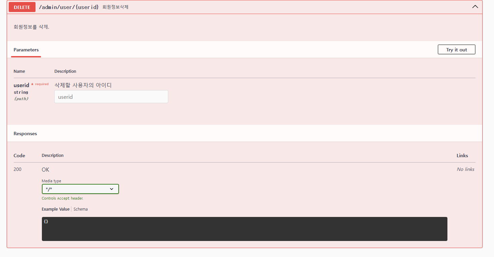

### 3. Attraction 여행 조회 

- 지역코드로 지역 정보 조회 
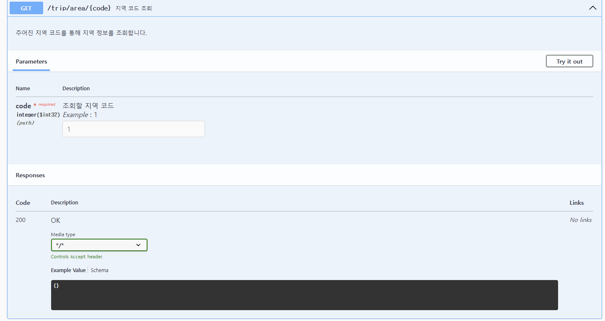

- 콘텐츠 ID로 관광지 상세 정보 조회 
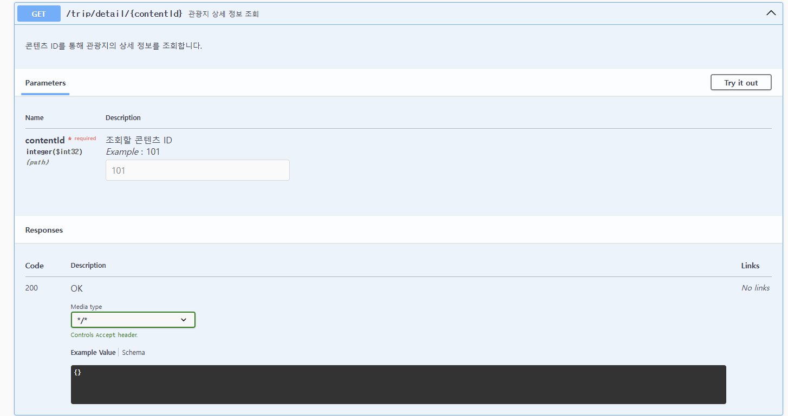

- 관광지 목록 필터링해서 조회 
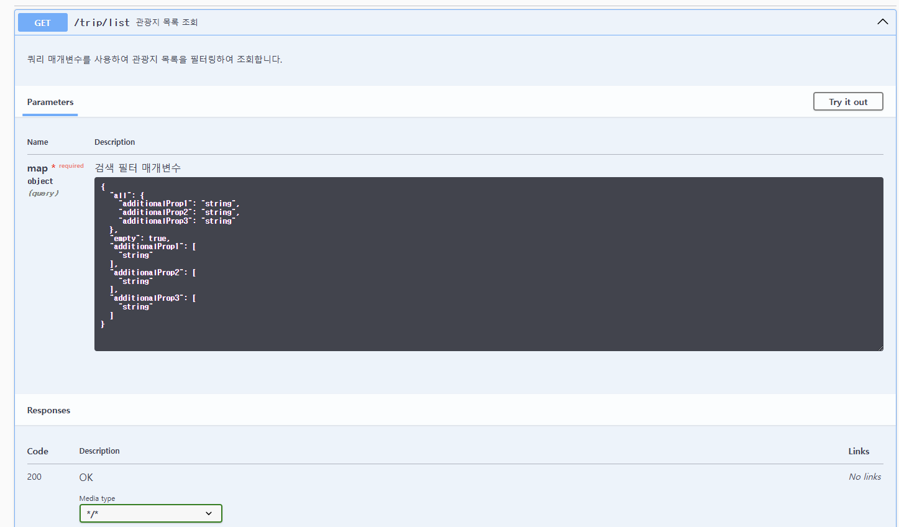

